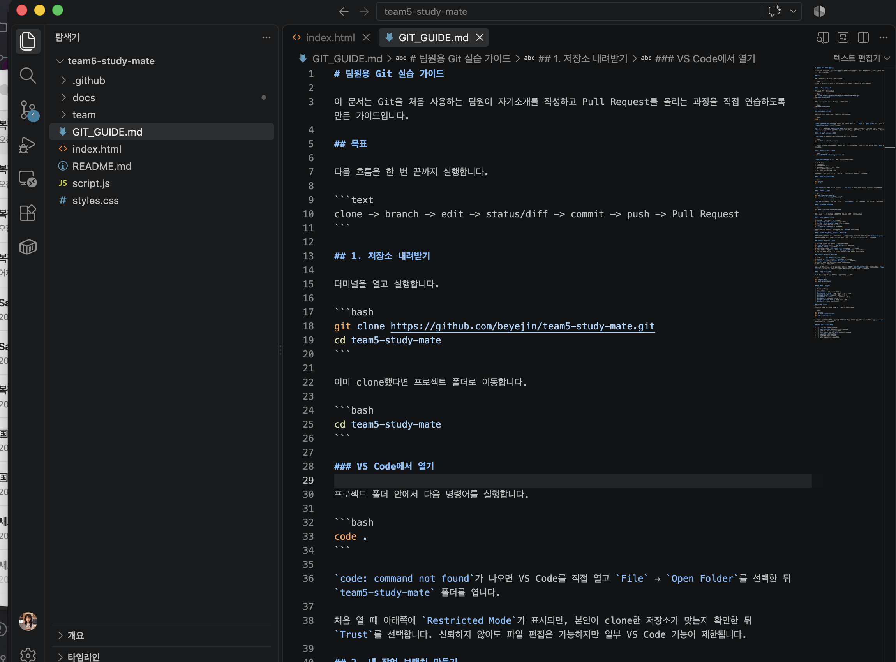
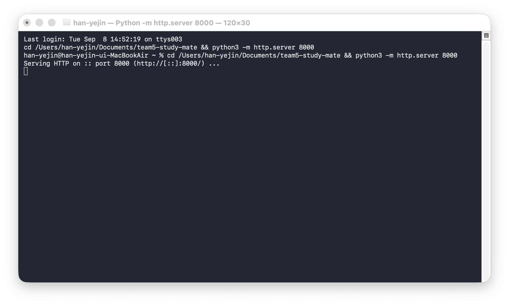

# 팀원 실행 및 Git 최소 흐름 안내

이 문서는 Team 5 저장소를 VS Code 또는 IntelliJ IDEA에서 열고 홈페이지를 실행한 뒤, 자기소개를 GitHub에 올리는 과정을 안내합니다.

## 1. 처음 한 번만 설정하기

### GitHub 브라우저 로그인

터미널에서 실행합니다.

```bash
gh auth login
```

화면에서 다음 항목을 선택합니다.

- `GitHub.com`
- `HTTPS`
- `Login with a web browser`

메뉴 번호는 버전에 따라 달라질 수 있으므로 `Login with a web browser`라는 문구를 확인합니다. 토큰, 비밀번호, 인증 코드는 팀원이나 AI에게 공유하지 않습니다.

### 저장소를 편집기에서 열기

```bash
git clone https://github.com/beyejin/team5-study-mate.git
cd team5-study-mate
```

#### VS Code를 사용하는 경우

```bash
code .
```

`code .`가 작동하지 않으면 VS Code에서 `File` → `Open Folder`를 선택하고 `team5-study-mate` 폴더를 엽니다.



#### IntelliJ IDEA를 사용하는 경우

```bash
idea .
```

`idea .`가 작동하지 않으면 IntelliJ IDEA에서 `Open`을 선택하고 `team5-study-mate` 폴더를 엽니다.

## 2. 홈페이지 실행하기

프로젝트 폴더에서 다음 명령어를 실행합니다.

```bash
python3 -m http.server 8000
```

VS Code는 `Terminal` → `New Terminal`, IntelliJ IDEA는 `View` → `Tool Windows` → `Terminal`에서 터미널을 열 수 있습니다.



브라우저에서 [http://localhost:8000](http://localhost:8000)을 엽니다.


서버를 종료할 때는 터미널에서 `Control + C`를 누릅니다.

## 3. 자기소개 작업의 최소 Git 흐름

### 새 작업을 시작할 때

```bash
git switch main
git pull origin main
git switch -c intro/your-name
cp team/TEMPLATE.md team/your-name.md
code team/your-name.md
```

`your-name`은 자신의 이름이나 GitHub 아이디로 바꿉니다. VS Code의 파일 탐색기나 IntelliJ IDEA의 `Project` 창에서 자기소개 파일을 열고 저장합니다.

### 작성이 끝났을 때

아래 세 명령어가 반복 작업의 핵심입니다.

```bash
git add team/your-name.md
git commit -m "docs: 자기소개 작성"
git push -u origin intro/your-name
```

같은 브랜치에서 다시 올릴 때는 다음처럼 `git push`만 실행합니다.

```bash
git push
```

### Pull Request가 반영된 뒤

```bash
git switch main
git pull origin main
```

정리하면 흐름은 다음과 같습니다.

```text
처음 설정: clone → 편집기 열기 → 브랜치 만들기
작성 후: git add → git commit → git push
PR 반영 후: git pull
```

## 4. Pull Request 올리기

1. GitHub 저장소에서 `Compare & pull request`를 선택합니다.
2. 제목을 `docs: 자기소개 작성`으로 입력합니다.
3. 변경한 내용을 간단히 적습니다.
4. `Create pull request`를 누릅니다.
5. 팀원 확인 후 반영을 기다립니다.

## 5. 문제가 생겼을 때

먼저 현재 브랜치와 변경 상태를 확인합니다.

```bash
git status
git branch --show-current
```

토큰이 화면에 보이거나 채팅에 붙여넣었다면 즉시 폐기하고 새 인증을 진행합니다. `reset --hard`, 강제 push, 저장소 삭제는 혼자 실행하지 않습니다.

## 체크리스트

- [ ] 브라우저 방식으로 GitHub 로그인을 완료했습니다.
- [ ] 저장소를 VS Code 또는 IntelliJ IDEA에서 열었습니다.
- [ ] 홈페이지를 로컬에서 실행했습니다.
- [ ] 자기소개 파일을 작성했습니다.
- [ ] `git add`를 실행했습니다.
- [ ] `git commit`을 만들었습니다.
- [ ] `git push`를 실행했습니다.
- [ ] Pull Request를 올렸습니다.
- [ ] 반영 후 `git pull`을 실행했습니다.
