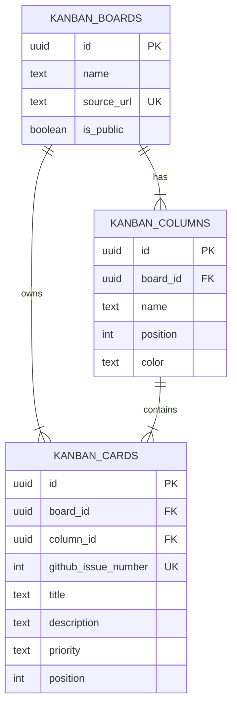

# TEAM 5 Kanban DB

> GitHub Project 보드를 Supabase 관계형 데이터베이스로 다시 설계한 과제 프로젝트

  
  
  
  

## 왜 만들었나요?

기존 Team 5 GitHub Project는 작업 상태를 편리하게 보여 주지만, 카드와 열이 어떤 관계로 저장되는지는 확인하기 어렵습니다. 이 프로젝트는 보드·열·카드를 독립된 테이블로 나누고 외래키로 연결해, 같은 간반 서비스를 데이터베이스 관점에서 구현합니다.

| GitHub Project에서 보이는 것 | Supabase에서 저장하는 것 |
| --- | --- |
| 하나의 작업 보드 | `kanban_boards` |
| Backlog / Ready / In Progress / Done | `kanban_columns` |
| Issue와 작업 카드 | `kanban_cards` |

## 핵심 기능

- 실제 Supabase PostgreSQL에 테이블 3개 생성
- 보드 → 열 → 카드의 1:N 관계를 외래키로 보장
- 실제 Team 5 보드 기준 열 4개와 카드 6개 입력
- 공개 페이지에서는 읽기만 가능하도록 RLS와 `SELECT` 정책 적용
- GitHub Pages 정적 화면에서 Supabase REST API로 카드 목록 렌더링

## 데이터 모델

### 관계를 이렇게 나눈 이유

`kanban_columns.board_id`는 열이 어느 보드에 속하는지, `kanban_cards.column_id`는 카드가 어느 상태 열에 놓이는지를 나타냅니다. 따라서 카드를 이동할 때는 카드의 `column_id`만 바꾸면 되고, 열 순서와 카드 순서는 각각 `position`으로 관리할 수 있습니다.

## 샘플 데이터

| 상태 | 작업 예시 | GitHub Issue |
| --- | --- | --- |
| Backlog | 팀원 자기소개 내용 취합 | #3 |
| Backlog | 피드백 의견 추가 | #8 |
| Ready | 자기소개 템플릿 작성 및 팀원 안내 | #4 |
| In Progress | 팀원 소개 홈페이지 만들기 | #2 |
| Done | 팀원 소개 README 초안 | #1 |
| Done | Git 실습과 보드 관리 | #5 |

## 보안 원칙

이 저장소에는 Supabase의 `service_role` 키를 포함하지 않습니다. 브라우저에는 공개용 anon 키만 사용하고, RLS 정책으로 공개 보드의 읽기만 허용합니다. 카드 추가·수정·삭제 기능은 로그인 및 팀 권한 정책을 추가한 뒤에만 열 수 있습니다.

## 프로젝트 보기

- [원본 GitHub Project 보드](https://github.com/users/beyejin/projects/1)
- [팀 소개 웹사이트](https://beyejin.github.io/team5-study-mate/)
- [상세 ERD 문서](kanban-erd.md)
