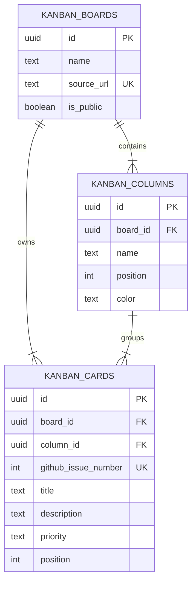

# Team 5 Kanban DB — Conceptual ERD

## 발표용 설명

- 하나의 보드에는 여러 개의 열이 있고 (`KANBAN_BOARDS` 1 : N `KANBAN_COLUMNS`), 각 열에는 여러 카드가 배치됩니다 (`KANBAN_COLUMNS` 1 : N `KANBAN_CARDS`).
- 카드는 보드에도 직접 연결해 다른 보드의 열로 잘못 이동하는 일을 방지하고, GitHub Issue 번호를 보드별로 한 번만 저장합니다.
- Supabase에서는 세 테이블 모두 RLS를 켰습니다. 공개 발표 사이트는 읽기만 허용하고, 카드 생성·수정·삭제는 인증 기능을 추가한 뒤 권한 정책으로 열도록 했습니다.
- 샘플 데이터는 실제 Team 5 GitHub Project의 Backlog, Ready, In Progress, Done 열과 카드 6개를 사용했습니다.
